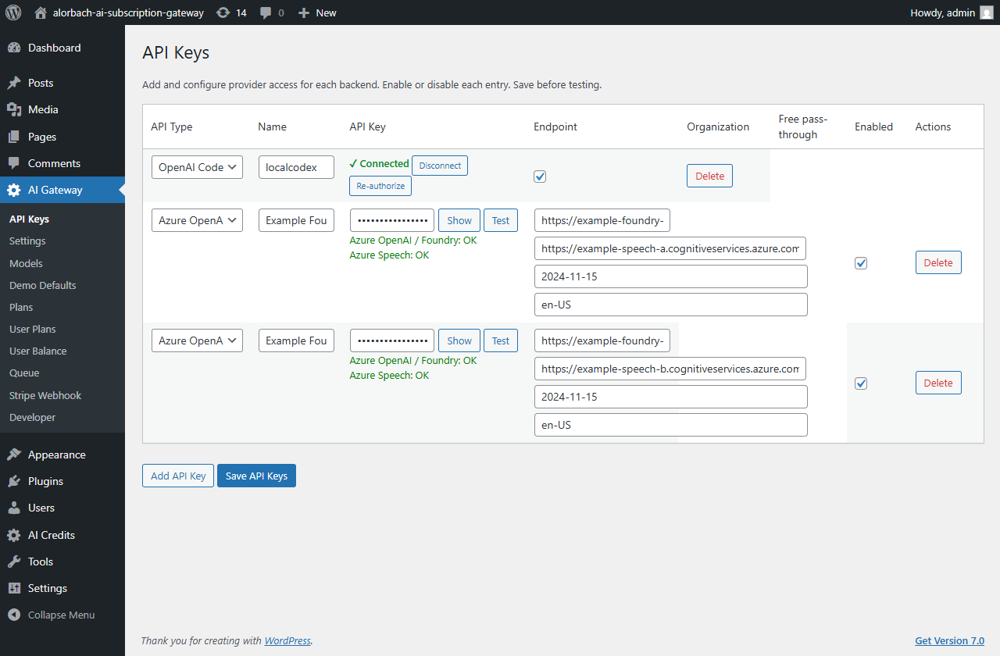
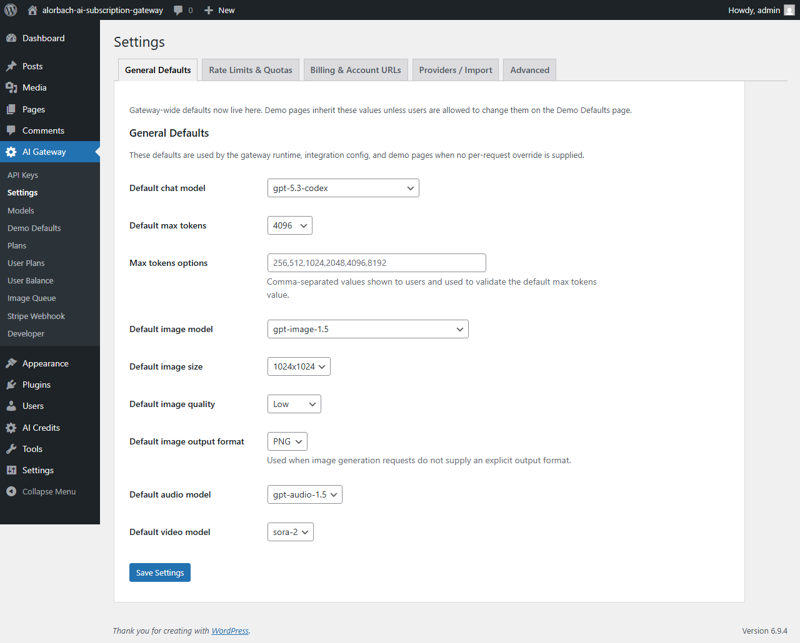
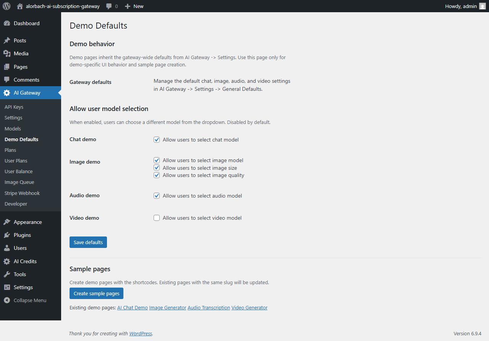
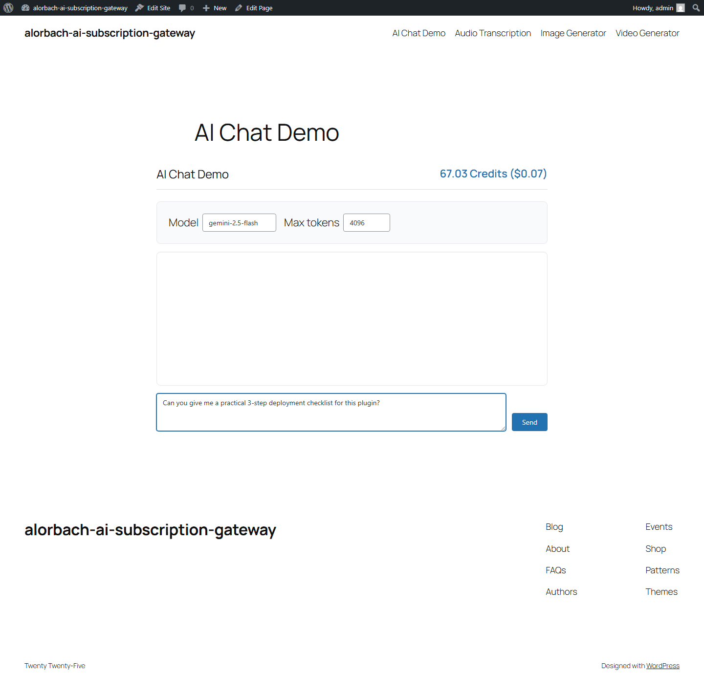
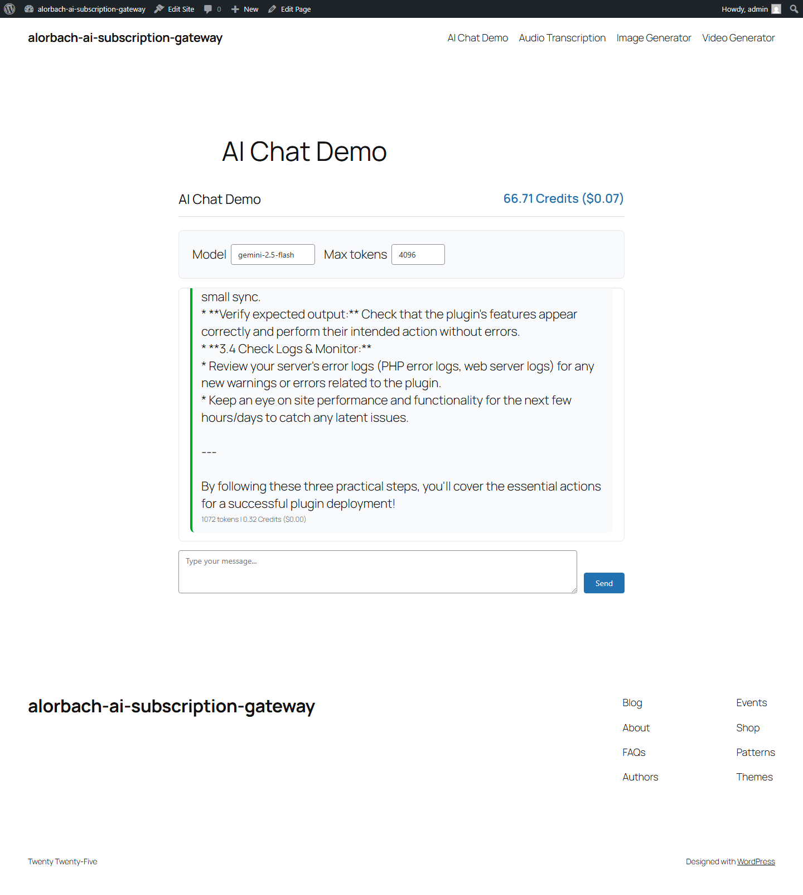
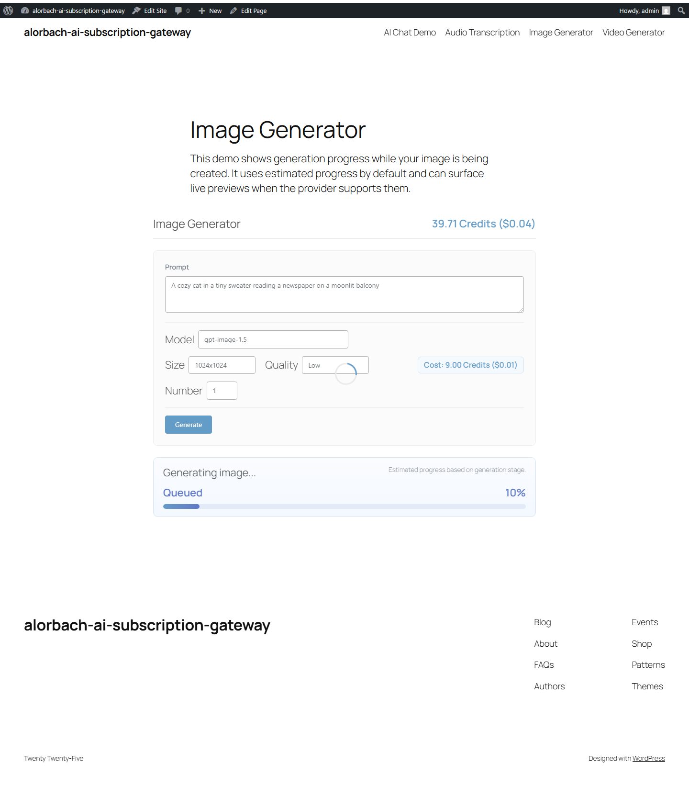
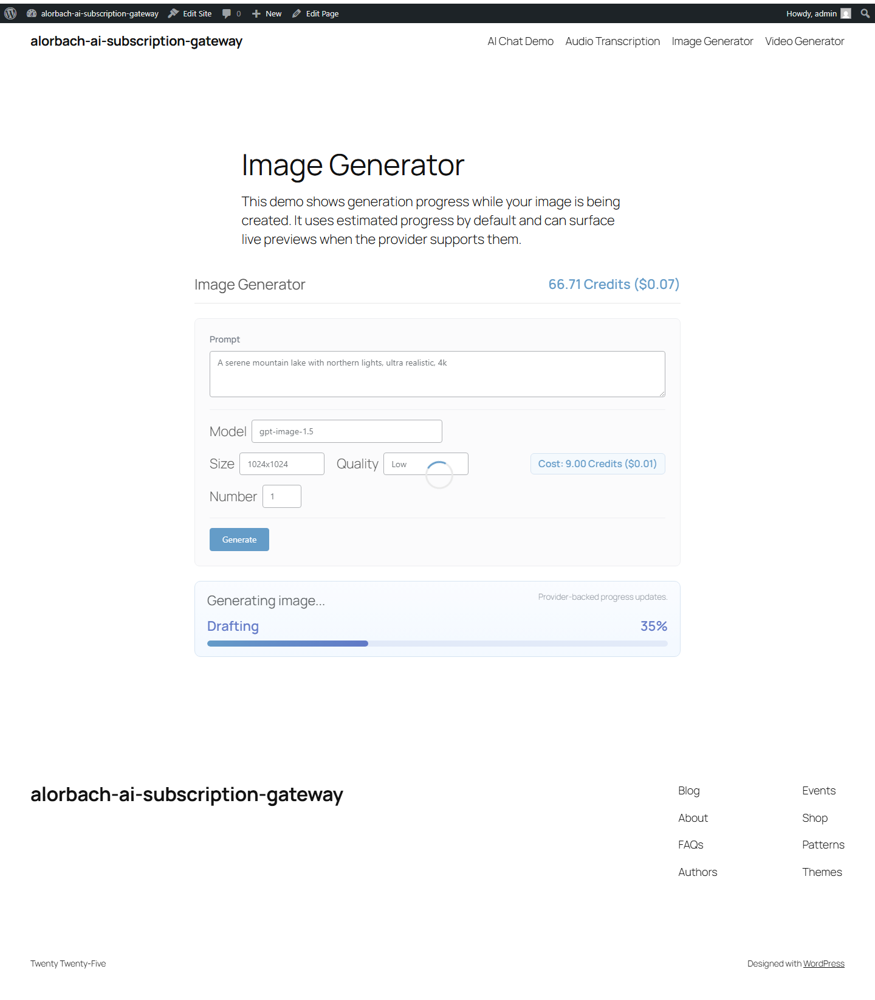
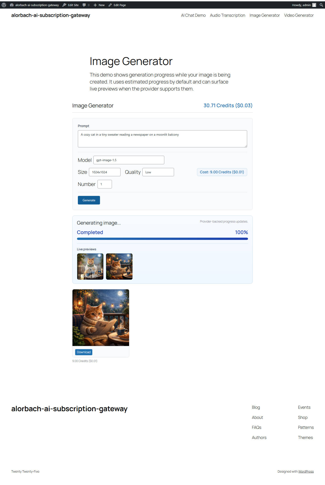

# Advanced User Guide

This guide helps plugin operators and integrators use the gateway in production-like setups and understand the current state of Hugging Face Spaces support.

Last updated: 2026-04-22

## Table of Contents

1. [Who this guide is for](#who-this-guide-is-for)
2. [Plugin flow in one screen](#plugin-flow-in-one-screen)
3. [Provider setup and API keys](#provider-setup-and-api-keys)
4. [Hugging Face Spaces: advanced setup](#hugging-face-spaces-advanced-setup)
5. [Demo workflow and API behavior](#demo-workflow-and-api-behavior)
6. [Async calls and image job lifecycle](#async-calls-and-image-job-lifecycle)
7. [Roadmap vs implementation state](#roadmap-vs-implementation-state)
8. [Error and verification behavior](#error-and-verification-behavior)
9. [Security and redaction rules for this guide and screenshots](#security-and-redaction-rules-for-this-guide-and-screenshots)
10. [Related public docs](#related-public-docs)

## Who this guide is for

Use this document if you:

1. Need to onboard clients or users with the WordPress admin UI.
2. Configure multiple providers or non-default request modes.
3. Troubleshoot verification, failures, and image jobs.
4. Need a transparent status of Hugging Face Spaces support before rollout planning.

## Plugin flow in one screen

At runtime, the plugin evaluates:

1. Active request context from a frontend page, theme, or plugin.
2. Provider selection by model mapping and capability checks.
3. Request execution path such as sync calls or async image jobs.
4. Response formatting plus balance, ledger, and cost updates.

The relevant admin flows are:

- API key and provider setup
- Gateway-wide defaults and plan settings
- Demo controls and sample page creation
- Image queue monitoring and job inspection

## Provider setup and API keys

### Screenshot workflow: base provider setup

1. Open WordPress admin as a role with plugin settings access.
2. Go to **AI Gateway -> API Keys**.
3. Add or edit a provider row:
   1. Provider identifier and label
   2. Encrypted key value
   3. Optional endpoint or header overrides
4. Save and verify the status indicator.

### What to check

1. Key fields are present and masked in UI.
2. Provider-specific extra fields appear only where relevant.
3. Save produces a successful admin notice.
4. No secrets are visible in screenshots or shared links.

## Hugging Face Spaces advanced setup

Hugging Face Spaces support uses a dedicated provider entry and provider-specific request mode fields.

### Supported mode and schema controls

1. **Space ID**: exact format expected by the plugin.
2. **Request mode**:
   1. `gradio_api` for Gradio API transport
   2. `custom_http` for custom endpoint behavior
3. **Schema preset**:
   1. Controls how request payload is shaped
   2. Supports manual schema alignment for known Spaces
4. **API key**: where required by the configured transport

### Screenshot workflow: HF Spaces configuration

1. Open **API Keys** and select a Hugging Face Spaces provider row.
2. Confirm `Space ID`, request mode, and schema preset.
3. Verify the connection using the built-in provider test.
4. Save after the test passes.

### Screenshot workflow: transport and request shape comparison

1. Configure one provider row with `gradio_api`.
2. Submit a test request from a demo page.
3. Capture event stream behavior and visible status updates.

## Demo workflow and API behavior

### Screenshot workflow: text or image demo request

1. Open a built-in demo page.
2. Choose the provider and model context exposed by the current demo settings.
3. Submit a prompt or image request.
4. Review the visible response, request timing, and cost display.

### Screenshot workflow: expected error state

Use this when a provider or request is not yet healthy.

1. Trigger a known-bad schema, endpoint, or credential state.
2. Confirm the visible error message and remediation hint.

### Recommended operator checks

1. After each provider or transport change, run a smoke demo after save.
2. Confirm request and error messages match the same model and preset combination used by your production pages.
3. Keep a copy of successful payload examples per environment.

## Async calls and image job lifecycle

Image requests may use async jobs in provider-aware flows.

### Screenshot workflow: image job lifecycle

1. Submit an image-capable request.
2. Open the queue monitor or job detail view.
3. Verify state transitions:
   1. Queued
   2. In progress
   3. Completed or failed

### Interpretation

1. Provider progress can be reported even when preview frames are not available.
2. Preview-frame support is capability-dependent and not guaranteed for every async-capable model.
3. Failed jobs surface through the job status plus any returned error details in the demo UI and admin queue.

## Roadmap vs implementation state

This table reflects the current plugin behavior.

| Area | Planned goal | Current implementation status |
| --- | --- | --- |
| Provider registration | Add dedicated Hugging Face Spaces provider integration | Implemented |
| API key/admin fields | Space ID, request mode, schema preset in provider form | Implemented |
| Verification | Probe or metadata checks during provider test | Implemented |
| Request shape handling | Manual model/schema and transport-aware payload generation | Partially implemented |
| Text-to-image transport | Gradio polling and custom HTTP behavior | Partially implemented |
| Zero-friction model/catalog UX | Curated list and import path | Planned |
| Retry and cancellation UX | Hardened retry and cancel controls | Not yet implemented |
| Advanced progress UX | Richer queue, progress, and state details | Partially implemented |
| Image preview support for Spaces | Preview rendering in all job states | Not implemented |
| Public onboarding with workflow screenshots | Updated guide and screenshots | Implemented |

The main remaining gaps are curated Spaces import, broader schema hardening, retries or cancellation, and richer ZeroGPU-style wait handling.

## Error and verification behavior

### Common behaviors

1. Provider verification failures usually surface as the provider's returned error message in the admin test flow.
2. Image job failures surface through the job `status`, `error`, `progress_stage`, and `progress_percent` fields.
3. Provider-backed progress and preview frames are separate capabilities.
4. Operators should treat queue status and returned error text as the main diagnostic signals, not invented symbolic status names.

### What users should do

1. Recheck provider configuration and selected preset.
2. Verify the service URL and transport path.
3. Retry once after transient network failures.
4. Open the Image Queue page when async calls fail repeatedly.

## Security and redaction rules for this guide and screenshots

1. Never include secrets in screenshots:
   1. API keys
   2. Access tokens
   3. Webhook secrets
2. Keep hostnames generic if they are internal-only.
3. If a screenshot contains masked input, blur or crop before commit.
4. For shared docs, replace user IDs and tenant identifiers if shown.
5. Keep screenshot metadata minimal; re-export when needed.

## Screenshot capture convention used in this guide

1. File naming: `{topic-kebab}.png`
2. Root folder:
   - `images/advanced-user/`
3. Standard size target:
   - `1200x800` desktop, cropped to the action-relevant panel only
4. Caption format:
   - `#1 Provider setup and key status`
   - `#2 HF Spaces configuration`
5. Verification checklist for each screenshot:
   - Context such as admin page and route
   - Action performed
   - Expected pre or post state
   - Error path observed when relevant
   - Sensitive values masked

## Related public docs

1. For plugin overview and endpoint summary, see [README](../README.md).
2. For downstream integration details, see [Developer Guide](../DEVELOPER-GUIDE.md).
